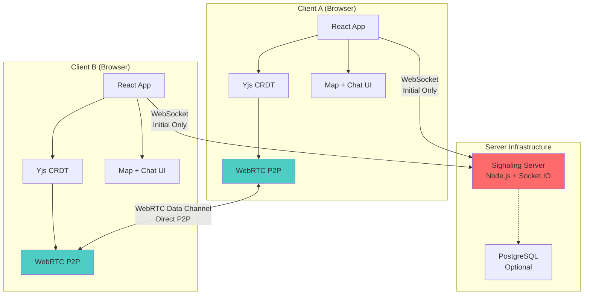
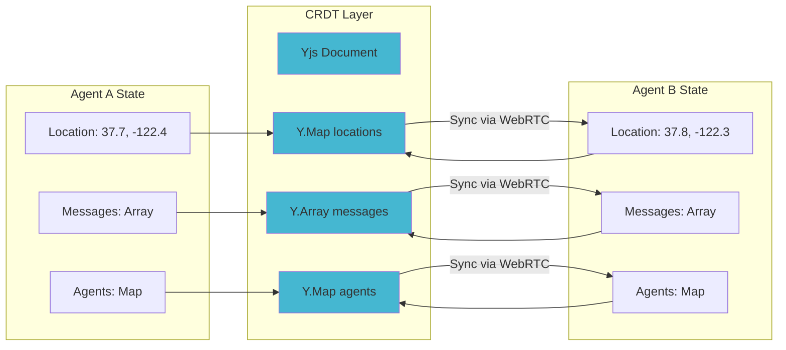
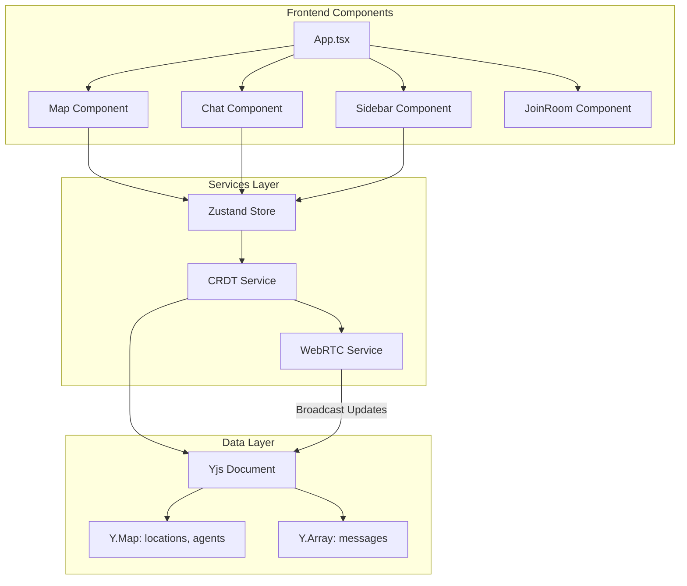
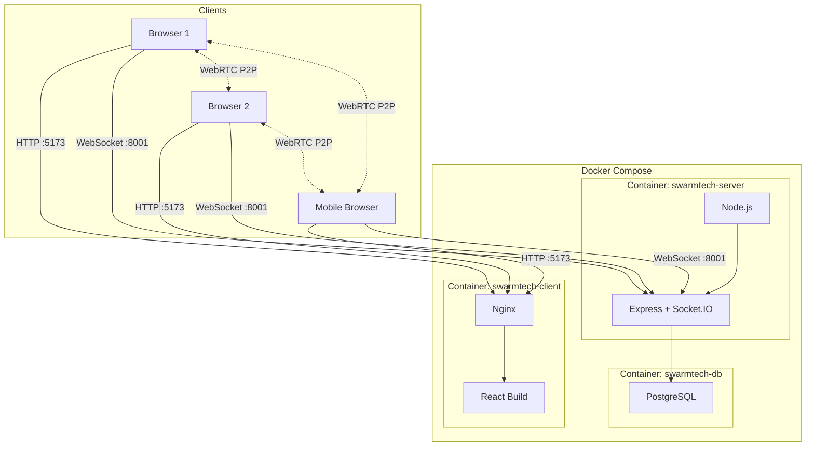
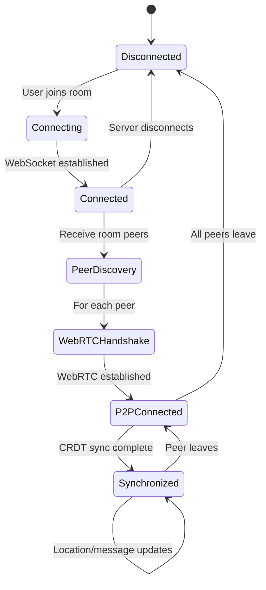
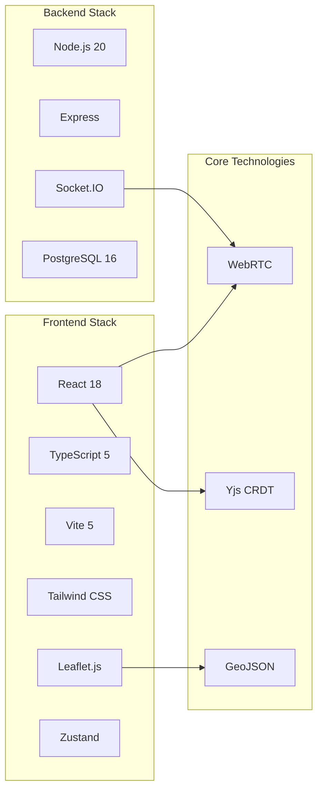

# SwarmTech Architecture Diagrams

## System Overview



## Connection Flow

```mermaid
sequenceDiagram
    participant A as Client A
    participant S as Signaling Server
    participant B as Client B

    Note over A,B: 1. Initial Connection
    A->>S: Connect via WebSocket
    B->>S: Connect via WebSocket

    Note over A,B: 2. Join Room
    A->>S: Join room "disaster-1"
    B->>S: Join room "disaster-1"
    S->>A: Room peers: [B]
    S->>B: Peer joined: A

    Note over A,B: 3. WebRTC Handshake
    A->>S: Offer (SDP)
    S->>B: Forward offer
    B->>S: Answer (SDP)
    S->>A: Forward answer
    A->>S: ICE candidates
    S->>B: Forward ICE
    B->>S: ICE candidates
    S->>A: Forward ICE

    Note over A,B: 4. Direct P2P Connection
    A<-->B: WebRTC Data Channel<br/>(Direct Connection)

    Note over A,B: 5. Data Synchronization
    A->>B: Yjs update (location)
    B->>A: Yjs update (message)
    A->>B: Yjs update (location)

    Note over A,B: Signaling server no longer needed!
```

## Data Synchronization



## Mesh Network Topology

```mermaid
graph TB
    subgraph "Room: disaster-response-1"
        A[Field Agent A]
        B[Field Agent B]
        C[Command Center]
        D[Volunteer]
    end

    A <-->|WebRTC| B
    A <-->|WebRTC| C
    A <-->|WebRTC| D
    B <-->|WebRTC| C
    B <-->|WebRTC| D
    C <-->|WebRTC| D

    style A fill:#4ECDC4
    style B fill:#4ECDC4
    style C fill:#FF6B6B
    style D fill:#52B788

    Note[Each peer connects to all others<br/>N peers = N×(N-1) connections<br/>Best for 2-5 participants]
```

## Component Architecture



## Deployment Architecture



## State Management Flow



## Technology Stack



---

## Legend

- **Solid lines**: Active connections
- **Dashed lines**: Optional or conditional
- **Blue**: Client/Frontend components
- **Red**: Server/Backend components
- **Green**: Data/State components
